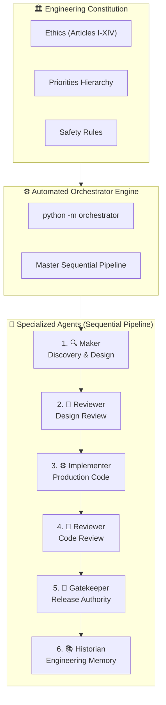
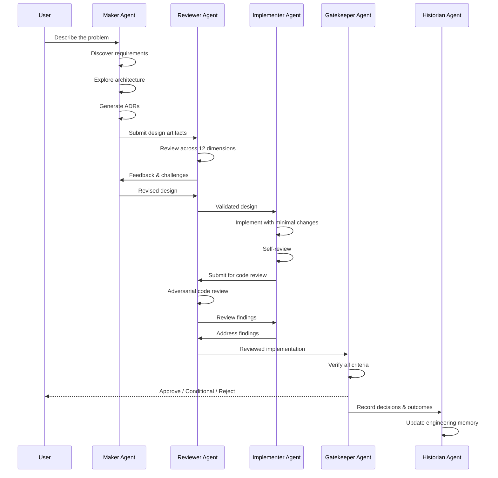

<p align="center">
  <h1 align="center">🏗️ AI Engineering Framework (AEF)</h1>
  <p align="center">
    <strong>An Engineering Operating System for AI-Assisted Software Development</strong>
  </p>
  <p align="center">
    <a href="#quick-start">Quick Start</a> •
    <a href="#agents">Agents</a> •
    <a href="#framework-architecture">Architecture</a> •
    <a href="docs/getting-started.md">Docs</a> •
    <a href="CONTRIBUTING.md">Contributing</a>
  </p>
</p>

---

## What is AEF?

The **AI Engineering Framework (AEF)** is a production-grade, model-agnostic framework that transforms AI coding assistants from generic code generators into **disciplined engineering agents** following enterprise software engineering practices.

Instead of relying on a single large prompt, AEF provides a **modular engineering system** consisting of:

- **5 Specialized Agents** — each with a distinct engineering role
- **Engineering Constitution** — immutable principles every agent inherits
- **Governance Documents** — repository-level engineering governance
- **Playbooks** — step-by-step guides for common engineering scenarios
- **Checklists** — verification lists for every phase of development
- **Templates** — standardized formats for engineering artifacts
- **Protocols** — formal procedures for engineering activities
- **Standards** — language-agnostic engineering standards

The framework guides the **complete Software Development Life Cycle (SDLC)** — from initial idea through architecture, implementation, review, testing, deployment, maintenance, and long-term evolution.

---

## Core Philosophy

> The framework behaves like a **senior engineering organization**, not an autocomplete system.

| Principle | Description |
|-----------|-------------|
| **Correctness over Speed** | Get it right, not just fast |
| **Root Cause over Symptom Fix** | Solve the real problem |
| **Evidence over Assumptions** | Every claim needs proof |
| **Architecture before Implementation** | Design first, code second |
| **Minimal Safe Changes** | Change only what's necessary |
| **Production-First Engineering** | Every line is production code |
| **Explicit Documentation** | If it's not documented, it doesn't exist |
| **Defensive Programming** | Assume everything can fail |
| **Continuous Review** | Every implementation is imperfect |
| **Engineering Governance** | Structure enables quality |

---

## Framework Architecture



---

## 🤖 End-to-End Automated Agent Orchestration

Rather than invoking agents individually, you can execute the **complete synchronized sequence** (Maker → Reviewer → Implementer → Reviewer → Gatekeeper → Historian) using the built-in orchestrator:

### Option A: Python CLI Orchestrator (Automated)

```bash
# Run using detected LLM provider (OpenAI / Anthropic / Gemini) or fallback to dry-run
python -m orchestrator "Build a REST API for task management"

# Force dry-run mode to inspect the pipeline flow without external API calls
python -m orchestrator "Build user authentication module" --dry-run
```

All stage outputs are saved to `.aef_output/` as verified markdown artifacts.

### Option B: Single-Prompt LLM Pipeline

You can copy the master prompt from [`protocols/end-to-end-pipeline.md`](protocols/end-to-end-pipeline.md) directly into your AI assistant session to run all 5 agents in a single continuous turn.

---

## Agents

| Agent | Role | Responsibility |
|-------|------|----------------|
| 🔍 **[Maker](agents/maker/)** | Discovery & Design | Requirement discovery, architecture exploration, ADR generation, technology evaluation |
| 🔬 **[Reviewer](agents/reviewer/)** | Independent Review | Adversarial review across 12 engineering dimensions, challenge assumptions |
| ⚙️ **[Implementer](agents/implementer/)** | Production Code | Minimal safe changes, production-quality code, SOLID/DRY/KISS/YAGNI, self-review |
| 🚪 **[Gatekeeper](agents/gatekeeper/)** | Release Authority | Verify requirements, architecture compliance, testing, production readiness |
| 📚 **[Historian](agents/historian/)** | Engineering Memory | Track decisions, technical debt, module ownership, preserve institutional knowledge |

---

## Quick Start

### 1. Clone the Framework

```bash
git clone https://github.com/paril-01/agents.git
```

### 2. Choose Your Agent

Select the agent appropriate for your current engineering task:

- **Starting a new project?** → Use the [Maker Agent](agents/maker/system-prompt.md)
- **Reviewing a design or code?** → Use the [Reviewer Agent](agents/reviewer/system-prompt.md)
- **Implementing a feature?** → Use the [Implementer Agent](agents/implementer/system-prompt.md)
- **Ready to release?** → Use the [Gatekeeper Agent](agents/gatekeeper/system-prompt.md)
- **Need historical context?** → Use the [Historian Agent](agents/historian/system-prompt.md)

### 3. Load the System Prompt

Copy the agent's `system-prompt.md` into your AI assistant's system prompt or custom instructions.

### 4. Follow the Workflow

Each agent has a `workflow.md` that defines the step-by-step process. Follow it.

### 5. Use the Supporting Materials

Reference the relevant [playbooks](playbooks/), [checklists](checklists/), [templates](templates/), and [standards](standards/) as needed.

---

## Repository Structure

```
agents/
├── constitution/       # 🏛️ Immutable engineering principles
├── agents/             # 🤖 5 specialized agent definitions
│   ├── maker/          #    Discovery & design agent
│   ├── reviewer/       #    Independent review agent
│   ├── implementer/    #    Implementation agent
│   ├── gatekeeper/     #    Release authority agent
│   └── historian/      #    Engineering memory agent
├── governance/         # 📋 Repository governance
├── playbooks/          # 📖 Engineering playbooks
├── checklists/         # ✅ Verification checklists
├── templates/          # 📄 Engineering templates
├── protocols/          # 🔁 Formal procedures
├── standards/          # 📏 Engineering standards
├── knowledge-graph/    # 🕸️ Knowledge graph system
├── traceability/       # 🔗 Traceability framework
├── memory/             # 🧠 Engineering memory
├── examples/           # 💡 Example projects
└── docs/               # 📚 Documentation
```

---

## Design Goals

AEF is designed to be:

- ✅ **Language-agnostic** — Works with any programming language
- ✅ **Architecture-agnostic** — Supports monoliths, microservices, serverless, etc.
- ✅ **IDE-agnostic** — Use with VS Code, JetBrains, Cursor, Windsurf, or any IDE
- ✅ **Model-agnostic** — Works with GPT, Claude, Gemini, Llama, or any LLM
- ✅ **Domain-agnostic** — Enterprise, AI/ML, research, distributed systems, etc.
- ✅ **Extensible** — Add new agents, playbooks, or standards as needed

---

## Engineering Workflow



---

## Traceability

Every engineering artifact is traceable through the full lifecycle:

```
Requirements → Architecture → ADR → Implementation → Tests → Deployment → Release
```

**Nothing exists without justification.**

---

## Contributing

We welcome contributions! Please see [CONTRIBUTING.md](CONTRIBUTING.md) for guidelines.

---

## License

This project is licensed under the MIT License — see [LICENSE](LICENSE) for details.

---

<p align="center">
  <strong>AEF — Because engineering discipline shouldn't be optional.</strong>
</p>
