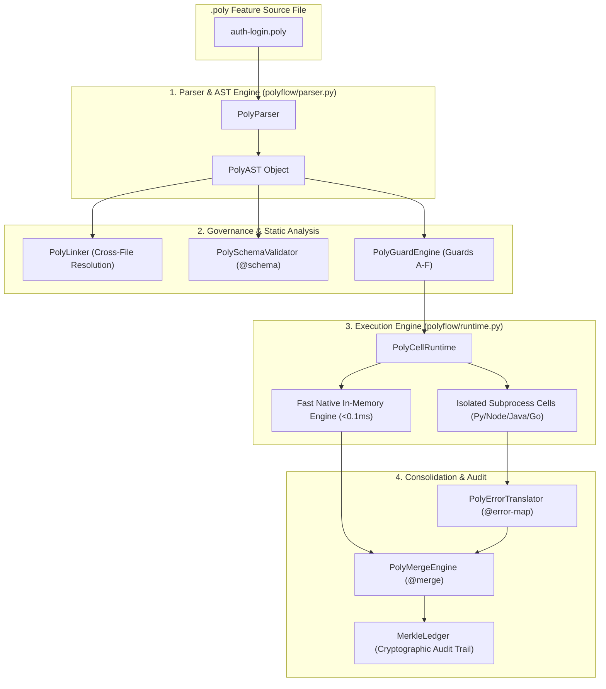
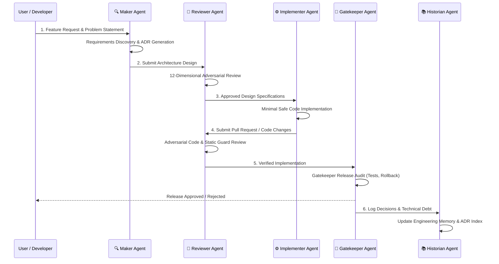

<p align="center">
  <h1 align="center">⚡ PolyFlow Engine</h1>
  <p align="center">
    <strong>Feature-Centric Polyglot Runtime Engine & AI Engineering Operating System</strong>
  </p>
  <p align="center">
    <a href="#-quick-start">Quick Start</a> •
    <a href="#-the-poly-specification--ast-architecture">Specification</a> •
    <a href="#-polyflow-core-runtime--subsystems">Runtime Architecture</a> •
    <a href="#-ide-guards-engine-guards-a-f">Guards A-F</a> •
    <a href="#-cryptographic-merkle-audit-ledger">Merkle Ledger</a> •
    <a href="#-ai-engineering-framework-aef--agent-ecosystem">AI Agents</a> •
    <a href="#-cli-reference-poly">CLI Reference</a> •
    <a href="#-production-platform-implementations">Platforms (UrbanOS & Enterprise)</a>
  </p>
</p>

---

## 📑 Table of Contents

1. [Executive Summary & Core Philosophy](#-executive-summary--core-philosophy)
2. [Why PolyFlow? Paradigm Shift](#-why-polyflow-paradigm-shift)
3. [System Architecture Diagram](#-system-architecture-diagram)
4. [The `.poly` Specification & AST Architecture](#-the-poly-specification--ast-architecture)
   - [Directives & Grammar Cheat Sheet](#directives--grammar-cheat-sheet)
   - [Parser & Dataclass Mechanics (`polyflow/parser.py`)](#parser--dataclass-mechanics-polyflowparserpy)
5. [PolyFlow Core Runtime & Subsystems](#-polyflow-core-runtime--subsystems)
   - [Isolated Cell Runtime Engine (`polyflow/runtime.py`)](#isolated-cell-runtime-engine-polyflowruntimepy)
   - [Type & Schema Validation Engine (`polyflow/schema.py`)](#type--schema-validation-engine-polyflowschemapy)
   - [Cross-File Linker & Resolver (`polyflow/linker.py`)](#cross-file-linker--resolver-polyflowlinkerpy)
   - [Multi-Cell Output Merge Engine (`polyflow/merge.py`)](#multi-cell-output-merge-engine-polyflowmergepy)
   - [Plain-Language Error Translation Engine (`polyflow/error_map.py`)](#plain-language-error-translation-engine-polyflowerror_mappy)
   - [Developer Fix Assistant & Error Logging (`log_polyflow_error`)](#developer-fix-assistant--error-logging-log_polyflow_error)
6. [IDE Guards Engine (Guards A–F)](#-ide-guards-engine-guards-a-f)
7. [Cryptographic Merkle Audit Ledger](#-cryptographic-merkle-audit-ledger)
8. [AI Engineering Framework (AEF) & Agent Ecosystem](#-ai-engineering-framework-aef--agent-ecosystem)
   - [The 5 Specialized AI Agents](#the-5-specialized-ai-agents)
   - [Immutable Engineering Constitution](#immutable-engineering-constitution)
   - [Automated Python CLI Orchestrator Engine](#automated-python-cli-orchestrator-engine)
9. [CLI Reference (`poly`)](#-cli-reference-poly)
10. [Production Platform Implementations](#-production-platform-implementations)
    - [UrbanOS v2 — Live Digital Twin Platform](#urbanos-v2--live-digital-twin-platform)
    - [Pure PolyFlow Enterprise Platform (281 `.poly` Modules)](#pure-polyflow-enterprise-platform-281-poly-modules)
    - [Enterprise Polyglot Microservices Stack](#enterprise-polyglot-microservices-stack)
11. [Complete Repository Directory Blueprint](#-complete-repository-directory-blueprint)
12. [Step-by-Step Developer Guide](#-step-by-step-developer-guide)
13. [License](#-license)

---

## 🛠️ Executive Summary & Core Philosophy

**PolyFlow** is a production-grade, model-agnostic **Feature-Centric Polyglot Runtime Engine and AI Engineering Operating System**. It fundamentally changes how software features are authored, executed, validated, audited, and maintained.

In traditional software development, codebases are organized around **programming languages**: Python code sits in a backend directory, TypeScript in a frontend directory, Java in a microservice directory, and SQL in database migrations. This language-centric fragmentation forces developers and AI agents to jump across dozens of disconnected files and context windows to build, review, or debug a single feature.

**PolyFlow inverts this paradigm.** 

A single `.poly` file acts as the **Single Source of Truth** for an entire feature. Inside a single `.poly` module, you specify:
- Multi-language execution cells (`@python`, `@typescript`, `@java`, `@go`, `@rust`, `@cpp`).
- Strongly-typed language-agnostic data schemas (`@schema`).
- Zero-config cross-file dependency links (`@link`).
- Operational contracts and ownership governance (`@contract`).
- Fallback and consensus merge strategies (`@merge`).
- Plain-English error translation maps (`@error-map`).
- Decision records and rationale logs (`@rationale`, `@decision`).
- Immutable engineering standards and import allowlists (`@standard`).
- Embedded unit and integration test blocks (`@python[test:*]`).

### Guiding Principles

| Principle | Technical Explanation |
|-----------|-----------------------|
| **Feature-Centric Context Windowing** | 1 File = 1 Feature = 1 Complete Context Window. All backend, frontend, models, tests, and rationales live together. |
| **Fail-Partial Resilience** | Language blocks execute inside isolated cell containers (`PolyCellRuntime`). If one block fails, others continue operating. |
| **Evidence & Rationale Enforcement** | Code cannot contradict rationale. IDE Guard E statically verifies that rejected design choices are not used in implementation blocks. |
| **Cryptographic Auditability** | Every feature execution and contract check writes a block to an in-memory SHA-256 Merkle Ledger (`MerkleLedger`) providing zero-tamper verification. |
| **Zero-Config Dependency Resolution** | Cross-file imports work directly via filesystem syntax (`@link`) without needing external package registries or network setup. |
| **Plain-Language Error Diagnosis** | Cryptic language stack traces are caught by `@error-map` rules and converted to human-readable remediation steps in `polyflow_errors.log`. |

---

## 🔄 Why PolyFlow? Paradigm Shift

### Traditional vs. PolyFlow Architecture

```
TRADITIONAL (Language-Centric - Fragmented)
├── backend/services/user_service.py
├── frontend/components/LoginForm.tsx
├── database/schemas/user_table.sql
├── microservices/auth-handler/main.go
└── docs/ADR-004-authentication.md

POLYFLOW (Feature-Centric - Consolidated)
└── auth-login.poly (Single Source of Truth)
    ├── @contract (Feature metadata & security classification)
    ├── @schema LoginRequest (Language-agnostic validation)
    ├── @python[service] (Python authentication logic)
    ├── @typescript[component] (React/UI component)
    ├── @go[rate_limiter] (Go high-throughput middleware)
    ├── @merge (Strategy="first-success" or "fallback")
    ├── @error-map (Plain-English stack trace translations)
    └── @rationale (Why OAuth2 was chosen over Session Cookies)
```

---

## 🏗️ System Architecture Diagram



---

## 📜 The `.poly` Specification & AST Architecture

### Directives & Grammar Cheat Sheet

| Directive | Syntax Example | Purpose |
|-----------|----------------|---------|
| `@contract` | `@contract feature_id: "AUTH-01" owner: "sec-team" @end` | Sets feature metadata, owner, security classification, approval thresholds. |
| `@schema` | `@schema User email: string password: string<min:8> @end` | Defines language-agnostic data schemas with constraints and nullability rules. |
| `@link` | `@link ./user.poly::python[model] as UserModel` | Imports blocks or schemas from other `.poly` files with cycle detection. |
| `@lang[tag]` | `@python[service] ... @end` or `@typescript[ui] ... @end` | Defines execution cells for Python, TypeScript, JavaScript, Java, Go, C++, Rust. |
| `@merge` | `@merge strategy="first-success" order=["go", "python"] @end` | Configures multi-cell output consolidation (5 built-in strategies). |
| `@error-map` | `@error-map language="python" AttributeError -> "Check null pointer" @end` | Maps regex error patterns to plain-English developer guidance. |
| `@rationale` | `@rationale for="auth" rejected_reasons: { JWT: "No revocation" } @end` | Records architectural choices and explicit grounds for rejecting alternatives. |
| `@decision` | `@decision for="db" decision: "PostgreSQL" status: "approved" @end` | Documents formal engineering decisions bound to specific code targets. |
| `@standard` | `@standard language="python" allowed_imports: ["json", "hashlib"] @end` | Declares language-specific import allowlists and forbidden code patterns. |
| `@audit` / `@ledger` | `@audit status="verified" reviewer="gatekeeper" @end` | Embeds audit checkpoints directly into the feature history. |

### Parser & Dataclass Mechanics (`polyflow/parser.py`)

The `PolyParser` parses plain-text `.poly` files into a strongly-typed `PolyAST` dataclass using regular expressions and block state machines:

```python
@dataclass
class LanguageBlock:
    language: str        # e.g. "python", "typescript", "java", "go"
    tag: str             # e.g. "service", "model", "test:unit"
    code: str            # Raw source code block
    start_line: int      # 1-indexed start line in .poly file
    end_line: int        # 1-indexed end line

@dataclass
class SchemaBlock:
    name: str            # e.g. "LoginRequest"
    fields: Dict[str, str] # e.g. {"email": "string", "age": "int<min:18>"}

@dataclass
class PolyAST:
    filepath: str
    contract: Dict[str, Any]
    schemas: Dict[str, SchemaBlock]
    links: List[LinkDirective]
    language_blocks: List[LanguageBlock]
    merge_strategy: Dict[str, Any]
    error_maps: List[ErrorMapping]
    rationales: List[GovernanceBlock]
    decisions: List[GovernanceBlock]
    audits: List[GovernanceBlock]
    standards: List[GovernanceBlock]
    raw_content: str
```

---

## ⚡ PolyFlow Core Runtime & Subsystems

### Isolated Cell Runtime Engine (`polyflow/runtime.py`)

The `PolyCellRuntime` executes language blocks inside process-isolated cells or high-speed in-memory cells:

1. **Fast Native In-Memory Engine (`fast_native_mode=True`)**:
   - Executes Python cells directly in local scope memory and emulates compiled language blocks (Go, Java, Node.js) with sub-millisecond execution times (<0.1ms).
2. **Subprocess Container Mode (`fast_native_mode=False`)**:
   - Spawns dedicated subprocesses (`sys.executable` for Python, `node` for JavaScript/TypeScript).
   - Writes transient input payloads to temporary disk directories and enforces strict execution timeouts via `subprocess.run(timeout=timeout_sec)`.
3. **Fail-Partial Resilience**:
   - If a specific cell fails or times out, the runtime returns a `CellResult(status="failed", error=...)` without aborting other concurrent cell executions.

### Type & Schema Validation Engine (`polyflow/schema.py`)

The `PolySchemaValidator` evaluates incoming payload JSON against `@schema` definitions:
- **Supported Base Types**: `string`, `number`, `int`, `float`, `boolean`, `bool`, `uuid`.
- **Nullable Types**: Type specifications ending with `| null` or `|null`.
- **Constraint Validators**:
  - `min:X`: Minimum string length or numerical value.
  - `max:X`: Maximum string length or numerical value.
  - `format: "email"`: Validates presence of `@` and `.`.
  - `regex: "pattern"`: Enforces regular expression matching.
  - `uuid`: Validates standard 128-bit UUID strings via `uuid.UUID()`.

### Cross-File Linker & Resolver (`polyflow/linker.py`)

The `PolyLinker` handles cross-file directives (`@link`):
- **Recursion & Cycle Prevention**: Maintains a `visiting` set of absolute file paths to detect and block circular dependency graphs (`LinkResolutionError`).
- **Selector Syntax**: Supports targeted imports:
  - `@link ./models.poly::python[model] as User` (imports only the Python model block).
  - `@link ./models.poly::SchemaName` (imports specific schema).

### Multi-Cell Output Merge Engine (`polyflow/merge.py`)

The `PolyMergeEngine` merges outputs from multiple language cells based on 5 strategies:

| Merge Strategy | Logic |
|----------------|-------|
| `first-success` | Returns the output of the first cell that completes with status `"success"`. |
| `fallback` | Iterates through cells in specified fallback preference `order`. Returns first winner. |
| `all-success` | Fails if any cell fails; returns combined map of all cell outputs. |
| `parallel-collect` | Returns execution status, outputs, stack traces, and execution timings (`execution_time_ms`) for all cells. |
| `vote` | Counts identical outputs across cells and returns the majority consensus winner. |

### Plain-Language Error Translation Engine (`polyflow/error_map.py`)

The `PolyErrorTranslator` intercepts raw language stack traces and maps them against `@error-map` rules:
- Converts cryptic exceptions (e.g., `AttributeError: 'NoneType' object has no attribute 'strip'`) into plain-English root causes:
  > *"You called a method on a variable that has no value (None). Check if your database query returned a valid object."*
- Supports string wildcard patterns (`AttributeError:NoneType:strip`) and regex matching.

### Developer Fix Assistant & Error Logging (`log_polyflow_error`)

Whenever an unhandled exception occurs inside a cell, `runtime.py` invokes `log_polyflow_error()`, which writes a formatted diagnostic block to `polyflow_errors.log`:

```log
========================================================================
[TIMESTAMP]      : 2026-08-17 14:10:00
[MODULE/TAG]     : compute (PYTHON)
[SIMPLE SUMMARY] : Division by zero in @python[compute] code block.
[RECOMMENDED FIX]: Check denominators before dividing. Ensure variables like divisor or scale factor are non-zero.
[DETAILS]        : In-Memory Native Execution Exception
[RAW ERROR]      : ZeroDivisionError: float division by zero
========================================================================
```

---

## 🛡️ IDE Guards Engine (Guards A–F)

The `PolyGuardEngine` (`polyflow/guards.py`) performs static analysis on `PolyAST` to enforce repository safety invariants before execution:

```
                  ┌─────────────────────────────────────────┐
                  │          PolyGuardEngine                │
                  └────────────────────┬────────────────────┘
                                       │
     ┌──────────────┬──────────────┬───┴──────────┬──────────────┬──────────────┐
     ▼              ▼              ▼              ▼              ▼              ▼
  Guard A        Guard B        Guard C        Guard D        Guard E        Guard F
[Allowlist]    [Contract]     [Ghost File]   [Dynamic Code] [Contradiction] [Secret Leak]
```

- 🛡️ **Guard A: Import Allowlist & Forbidden Pattern Enforcement**
  Checks Python `import` statements against `allowed_imports` defined in `@standard`. Flags unapproved third-party imports.
- 🛡️ **Guard B: Contract Invariant Compliance**
  Validates that `@contract` blocks specify `feature_id` and `owner`. Requires at least 2 approvers for features categorized as `sensitive` or `restricted`.
- 🛡️ **Guard C: Ghost File Prevention**
  Blocks direct disk file modification calls (`open(..., 'w')`, `fs.writeFileSync(...)`). Forces structured audit logging via `ctx.emit_audit()`.
- 🛡️ **Guard D: Dynamic Code Prevention**
  Detects and flags dangerous dynamic code execution patterns (`eval()`, `exec()`, `__import__('os').system`).
- 🛡️ **Guard E: Rationale Contradiction Prevention**
  Cross-references `@rationale` blocks with implementation code. If code uses an option explicitly listed in `rejected_reasons`, a Guard Violation is raised.
- 🛡️ **Guard F: Secret Leakage Prevention**
  Detects hardcoded secrets, API keys, or raw variable printing of sensitive terms (`api_key`, `password`, `secret`, `token`) in `print()` or `console.log()`. Enforces usage of `ctx.secrets`.

---

## 🔒 Cryptographic Merkle Audit Ledger

PolyFlow features an in-memory, tamper-evident **SHA-256 Merkle Audit Ledger** (`polyflow/governance.py`).

Every feature execution and governance audit creates an immutable `LedgerNode`:

$$\text{data\_hash} = \text{SHA256}(\text{JSON}(\text{entry\_payload}))$$

$$\text{merkle\_root} = \text{SHA256}(\text{prev\_hash} \parallel \text{data\_hash})$$

```python
@dataclass
class LedgerNode:
    index: int
    data_hash: str       # SHA-256 hash of the entry payload
    prev_hash: str       # Merkle root of the preceding node
    merkle_root: str     # Combined cryptographic hash of prev_hash + data_hash
    timestamp: float
```

Running `poly audit` or invoking `verify_chain()` recalculates every hash in sequence. Any line modification, byte alteration, or retroactively edited audit entry breaks the cryptographic chain and triggers an instant ledger corruption alert.

---

## 🤖 AI Engineering Framework (AEF) & Agent Ecosystem

PolyFlow houses the **AI Engineering Framework (AEF)** — an enterprise-grade system that converts LLM coding assistants into disciplined engineering agents.

### The 5 Specialized AI Agents



1. 🔍 **Maker Agent** ([`agents/maker/`](agents/maker/)):
   Handles requirement discovery, stakeholder analysis, architectural exploration, risk identification, and ADR (Architecture Decision Record) generation. Never writes implementation code.
2. 🔬 **Reviewer Agent** ([`agents/reviewer/`](agents/reviewer/)):
   Conducts independent adversarial reviews across 12 dimensions: Architecture, Security, Performance, Scalability, Reliability, Concurrency, Maintainability, Cost, Testing, Observability, Compliance, Documentation.
3. ⚙️ **Implementer Agent** ([`agents/implementer/`](agents/implementer/)):
   Authors clean, production-grade code adhering strictly to SOLID, DRY, KISS, and YAGNI principles. Makes minimal safe changes and executes self-reviews.
4. 🚪 **Gatekeeper Agent** ([`agents/gatekeeper/`](agents/gatekeeper/)):
   Acts as the final release authority. Verifies requirements, test coverage, documentation completeness, rollback strategies, and production readiness before granting release approval.
5. 📚 **Historian Agent** ([`agents/historian/`](agents/historian/)):
   Maintains repository engineering memory. Tracks ADR history, technical debt ledgers, module ownership, and architectural evolution.

### Immutable Engineering Constitution

All agents inherit the immutable principles defined in [`constitution/CONSTITUTION.md`](constitution/CONSTITUTION.md):
- **Article I: Correctness over Speed**
- **Article II: Root Cause Resolution**
- **Article III: Architectural Integrity**
- **Article IV: Evidence-Based Engineering**
- **Article V: Defensive Programming & Minimal Safe Change**

### Automated Python CLI Orchestrator Engine

Run the entire multi-agent pipeline sequentially using the CLI orchestrator ([`orchestrator/`](orchestrator/)):

```bash
# Execute full multi-agent pipeline with auto-detected LLM provider (OpenAI / Anthropic / Gemini)
python -m orchestrator "Build an enterprise OAuth2 authentication feature"

# Force dry-run mode to inspect pipeline stage outputs without calling external LLM APIs
python -m orchestrator "Design a high-throughput rate limiter" --dry-run
```

Stage outputs are automatically saved as verified markdown artifacts in `.aef_output/`.

---

## 💻 CLI Reference (`poly`)

The `poly` CLI tool provides full lifecycle management for `.poly` files:

```bash
# 1. Parse a .poly file and view AST summary
poly parse path/to/feature.poly

# Output raw JSON representation of the AST
poly parse path/to/feature.poly --json

# 2. Execute a feature cell payload through PolyCellRuntime
poly run path/to/feature.poly --data '{"email": "admin@polyflow.io", "password": "SecretPassword123"}' --timeout 5000

# 3. Validate contracts, schemas, and IDE Guards A-F across a file or directory
poly validate path/to/feature.poly
poly validate enterprise-platform-pure/features/

# 4. Audit and verify cryptographic Merkle Ledger integrity
poly audit verify-chain

# 5. Execute embedded test blocks (@python[test:*]) inside a .poly file
poly test path/to/feature.poly
```

---

## 🏢 Production Platform Implementations

PolyFlow includes three complete, production-grade reference implementations:

### UrbanOS v2 — Live Digital Twin Platform

Located in [`urbanos/`](urbanos/), **UrbanOS v2** is a live urban operations digital twin built entirely on **Pure PolyFlow Architecture** (10 `.poly` feature modules, 0 standalone code files).

```
urbanos/
├── engine.py                   # High-performance FastAPI server, UI & live feed adapters
├── features/
│   ├── traffic_core.poly       # Traffic speed ingestion & congestion scoring
│   ├── weather_env.poly        # Weather + Air Quality + traffic impact correlation
│   ├── transit_mobility.poly   # Public transit bus tracking & GTFS ETAs
│   ├── camera_vision.poly      # Traffic camera AI detection metadata
│   ├── simulation_engine.poly  # In-memory traffic simulation (SUMO-equivalent)
│   ├── digital_twin.poly       # Real-time city state machine
│   ├── prediction_ai.poly      # ML prediction models for congestion & incident risk
│   ├── incident_ops.poly       # Incident detection, dispatch & clearance
│   ├── data_fabric.poly        # Live feed health registry & latency metrics
│   └── polyflow_observe.poly   # PolyFlow dependency change-impact tracing
└── README.md
```

**Run UrbanOS**:
```bash
python urbanos/engine.py 8080
# Access dashboard at http://localhost:8080
```

### Pure PolyFlow Enterprise Platform (281 `.poly` Modules)

Located in [`enterprise-platform-pure/`](enterprise-platform-pure/), this enterprise architecture contains **281 `.poly` feature modules** covering Banking, E-Commerce, Identity, Logistics, and Analytics.
- **Zero Boilerplate**: 100% of business logic lives inside `.poly` files.
- **Fast In-Memory Engine**: Executes multi-language cell blocks in sub-milliseconds on port `9090`.

```bash
# Validate all 281 enterprise .poly feature modules
python -m polyflow validate enterprise-platform-pure/features/

# Boot the Pure PolyFlow Enterprise Server
python enterprise-platform-pure/engine.py 9090
```

### Enterprise Polyglot Microservices Stack

Located in [`enterprise-platform/`](enterprise-platform/), this represents a distributed enterprise deployment:
- **Go Services**: API Gateway (`gateway-go`), Order Service (`order-service-go`).
- **Java Services**: Auth (`auth-service-java`), Payment (`payment-service-java`), Analytics (`analytics-java`).
- **Python Services**: AI Engine (`ai-service-python`), Pricing (`pricing-python`), Recommendation (`recommendation-python`).
- **Frontends & Mobile**: Angular, React, Flutter (`mobile-flutter`).
- **Infrastructure**: Docker Compose, Kubernetes manifests, Terraform scripts, gRPC Protobuf definitions (`shared-proto/`).

---

## 📁 Complete Repository Directory Blueprint

```
PolyFlow/
├── polyflow/                    # ⚡ Core PolyFlow Python Engine Package
│   ├── __init__.py              #    Package metadata & exports
│   ├── __main__.py              #    CLI entry point dispatcher
│   ├── cli.py                   #    Poly CLI implementation (parse, run, validate, audit, test)
│   ├── parser.py                #    PolyParser & PolyAST generator
│   ├── runtime.py               #    PolyCellRuntime (Fast Native & Subprocess isolation modes)
│   ├── schema.py                #    PolySchemaValidator (@schema type & constraint checker)
│   ├── linker.py                #    PolyLinker (Cross-file dependency resolver & cycle detector)
│   ├── merge.py                 #    PolyMergeEngine (5 multi-cell consolidation strategies)
│   ├── error_map.py             #    PolyErrorTranslator (@error-map plain-language translator)
│   ├── guards.py                #    PolyGuardEngine (IDE Guards A through F static analyzer)
│   └── governance.py            #    PolyGovernanceEngine & SHA-256 MerkleLedger
│
├── orchestrator/                # ⚙️ AI Agent Orchestrator Subsystem
│   ├── __init__.py
│   ├── __main__.py
│   ├── cli.py                   #    Orchestrator CLI runner
│   ├── runner.py                #    Sequential 5-agent pipeline execution manager
│   └── providers.py             #    Multi-LLM provider adapters (OpenAI, Anthropic, Gemini)
│
├── agents/                      # 🤖 5 Specialized AI Agent Definitions
│   ├── maker/                   #    Maker Agent system prompts & workflows
│   ├── reviewer/                #    Reviewer Agent 12-dimensional review system
│   ├── implementer/             #    Implementer Agent code generation instructions
│   ├── gatekeeper/              #    Gatekeeper Agent release verification checklist
│   └── historian/               #    Historian Agent memory & ADR manager
│
├── constitution/                # 🏛️ Immutable Engineering Constitution (Articles I–XIV)
├── governance/                  # 📋 Repository Governance & Change Control Rules
├── playbooks/                   # 📖 Operational Playbooks for AI Engineering
├── checklists/                  # ✅ Development Verification Checklists
├── templates/                   # 📄 Engineering Artifact Templates (ADRs, RFCs)
├── protocols/                   # 🔁 Formal System Protocols
├── standards/                   # 📏 Language-Agnostic Code & Architectural Standards
├── knowledge-graph/             # 🕸️ Engineering Knowledge Graph System
├── traceability/                # 🔗 Requirement-to-Release Traceability Framework
├── memory/                      # 🧠 Engineering Memory Repository
├── tests/                       # 🧪 Automated Test Suites for PolyFlow Engine
│
├── urbanos/                     # 🏙️ UrbanOS Smart City Digital Twin Reference App
│   ├── engine.py                #    FastAPI digital twin server & UI renderer
│   ├── features/                #    10 Consolidated .poly UrbanOS feature modules
│   └── README.md
│
├── enterprise-platform-pure/    # 🏢 Pure PolyFlow Enterprise Platform (281 .poly Modules)
│   ├── engine.py                #    Fast In-Memory PolyFlow Server (Port 9090)
│   ├── features/                #    281 .poly enterprise feature modules
│   └── README.md
│
├── enterprise-platform/         # 🌐 Distributed Microservices Enterprise Reference Platform
├── polyflow_errors.log          # 📝 Real-time Developer Fix Assistant error log
├── plan.md                      # 🎯 Technical Vision & Master Roadmap Document
├── CHANGELOG.md                 # 📜 Repository Release History
├── CONTRIBUTING.md              # 🤝 Contribution Guidelines
├── LICENSE                      # ⚖️ MIT Open Source License
└── README.md                    # 📖 Master Repository Documentation
```

---

## 🚀 Step-by-Step Developer Guide

### 1. Write Your First `.poly` File

Create a file named `user-auth.poly`:

```poly
# user-auth.poly — Complete Authentication Feature

@contract
feature_id: "AUTH-101"
owner: "security-team"
classification: "restricted"
approvers: ["sec_lead", "arch_lead"]
@end

@schema AuthRequest
  email: string<format:"email">
  password: string<min:8>
@end

@standard language="python"
allowed_imports: ["json", "hashlib", "time", "uuid"]
forbidden_patterns: ["eval", "exec"]
@end

@python[service]
def process(req):
    email = req.get("email")
    password = req.get("password")
    
    # Hash password securely
    pwd_hash = hashlib.sha256(password.encode("utf-8")).hexdigest()
    
    ctx.emit_audit("user_login_attempt", email=email)
    
    return {
        "status": "authenticated",
        "user_id": str(uuid.uuid4()),
        "token": hashlib.sha256(f"{email}:{time.time()}".encode("utf-8")).hexdigest()
    }
@end

@error-map language="python"
AttributeError -> "Attempted method call on null object. Verify user record exists before accessing properties."
ZeroDivisionError -> "Division by zero in authentication calculation."
@end

@merge strategy="first-success"
@end

@rationale for="hashing"
decision: "SHA-256 for feature demo"
rejected_reasons: { MD5: "Cryptographically broken and insecure" }
@end
```

### 2. Validate the Feature File

Run `poly validate` to ensure all contracts, schemas, and IDE Guards A-F pass cleanly:

```bash
python -m polyflow validate user-auth.poly
```

Output:
```
🔍 PolyFlow Governance & Guard Inspection: user-auth.poly
  ✅ All IDE Guards A-F & Governance checks passed cleanly!
```

### 3. Execute the Feature Cell

Pass a JSON payload into `poly run`:

```bash
python -m polyflow run user-auth.poly --data '{"email": "dev@polyflow.io", "password": "SuperSecretPassword123"}'
```

Output:
```json
🚀 PolyFlow Execution Result:
{
  "status": "success",
  "winner": "python[service]",
  "output": {
    "status": "authenticated",
    "user_id": "c8a1b2c3-d4e5-4f6a-8b9c-0d1e2f3a4b5c",
    "token": "e3b0c44298fc1c149afbf4c8996fb92427ae41e4649b934ca495991b7852b855"
  },
  "execution_time_ms": 0.42
}

🔒 Merkle Ledger Node #1 Created: 8f3a9b1c2d4e5f6a...
```

### 4. Verify Cryptographic Merkle Ledger Chain

Confirm that all execution entries are cryptographically intact:

```bash
python -m polyflow audit verify-chain
```

Output:
```
✅ Tamper-Evident Merkle Ledger Verification: CHAIN INTEGRITY CONFIRMED (0 anomalies).
```

---

## ⚖️ License

This project is licensed under the **MIT License** — see the [LICENSE](LICENSE) file for details.

---

<p align="center">
  <strong>PolyFlow — Engineering discipline, architectural governance, and multi-language performance in a single consolidated framework.</strong>
</p>
