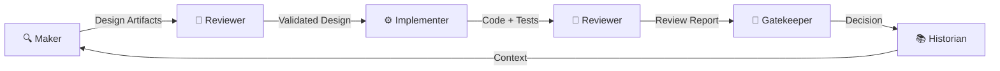

# 🤖 Specialized Agents

The AI Engineering Framework defines **five specialized agents**, each responsible for a distinct phase of the engineering lifecycle. Together, they form a complete engineering organization.

---

## Agent Overview

| Agent | Role | Primary Responsibility |
|-------|------|----------------------|
| 🔍 [Maker](maker/) | Discovery & Design | Requirements, architecture, ADRs |
| 🔬 [Reviewer](reviewer/) | Independent Review | Adversarial validation across 12 dimensions |
| ⚙️ [Implementer](implementer/) | Production Code | Minimal, safe, production-quality implementation |
| 🚪 [Gatekeeper](gatekeeper/) | Release Authority | Release readiness verification |
| 📚 [Historian](historian/) | Engineering Memory | Institutional knowledge preservation |

---

## Agent Orchestration

Agents follow a defined workflow where each agent's output feeds into the next:

### Workflow Rules

1. **No agent skipping** — Every artifact must pass through the appropriate agents
2. **Clear handoffs** — Each agent produces well-defined outputs for the next
3. **Independent operation** — Each agent operates independently and doesn't defer to others
4. **Constitutional compliance** — All agents inherit and follow the [Engineering Constitution](../constitution/)

---

## How to Use Agents

### Step 1: Identify Your Phase

| You need to... | Use this agent |
|----------------|---------------|
| Understand requirements | 🔍 Maker |
| Evaluate a design | 🔬 Reviewer |
| Write production code | ⚙️ Implementer |
| Validate for release | 🚪 Gatekeeper |
| Understand past decisions | 📚 Historian |

### Step 2: Load the System Prompt

Each agent has a `system-prompt.md` file. Copy its contents into your AI assistant's system prompt or custom instructions.

### Step 3: Follow the Workflow

Each agent has a `workflow.md` that defines the step-by-step process. Follow it precisely.

### Step 4: Use Supporting Materials

Reference the agent's supporting documents (protocols, checklists, templates) as needed during the workflow.

---

## Agent Composition

For complex tasks, you may use **multiple agents in sequence**:

- **New Feature**: Maker → Reviewer → Implementer → Reviewer → Gatekeeper → Historian
- **Bug Fix**: Historian → Implementer → Reviewer → Gatekeeper → Historian
- **Architecture Change**: Maker → Reviewer → Maker (iterate) → Implementer → Reviewer → Gatekeeper → Historian
- **Code Review Only**: Reviewer
- **Research/Exploration**: Maker → Historian
