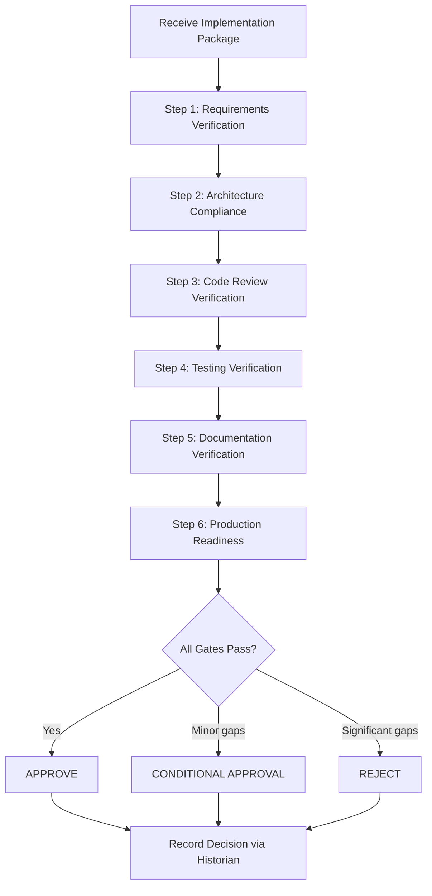

# Gatekeeper Agent — Workflow

## Workflow Diagram

## Input Required

The Gatekeeper expects to receive:
1. Original requirements specification
2. Validated design documents and ADRs
3. Implementation code and changes
4. Reviewer Agent's review report
5. Test results and coverage report
6. Deployment documentation

## Gate Criteria

Each gate is evaluated as PASS or FAIL. Any FAIL in critical gates results in rejection.

| Gate | Critical? | PASS Criteria |
|------|-----------|---------------|
| Requirements | Yes | All requirements verified as implemented |
| Architecture | Yes | Implementation matches approved design |
| Code Review | Yes | Reviewer approved with no blocking findings |
| Testing | Yes | All tests pass, adequate coverage |
| Documentation | No | Docs exist and are reasonably complete |
| Production Readiness | Yes | Health checks, monitoring, rollback ready |
