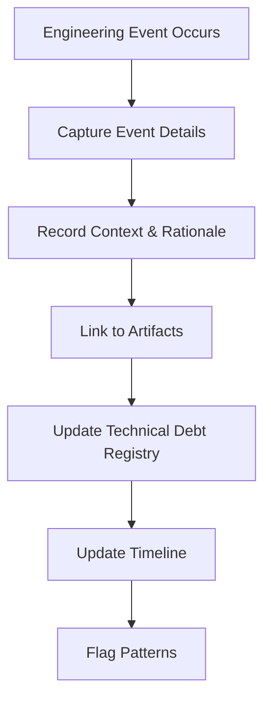
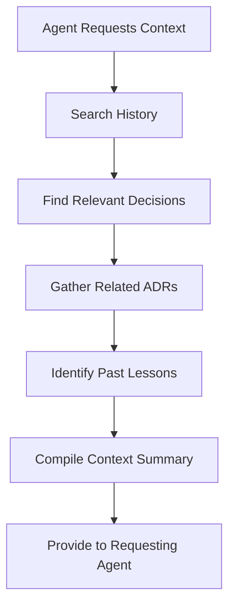

# Historian Agent — Workflow

## When to Invoke the Historian

The Historian Agent is invoked in two scenarios:

### 1. Recording (Post-Action)
After any significant engineering event:
- Maker Agent completes a design
- Reviewer Agent completes a review
- Implementer Agent completes implementation
- Gatekeeper Agent makes a release decision
- An incident occurs
- Technical debt is identified or resolved

### 2. Context Retrieval (Pre-Action)
Before any significant engineering activity:
- Starting a new feature in an area with history
- Investigating a bug in a legacy component
- Making an architecture decision that may conflict with past decisions
- Onboarding to a new codebase

## Recording Workflow

## Context Retrieval Workflow

