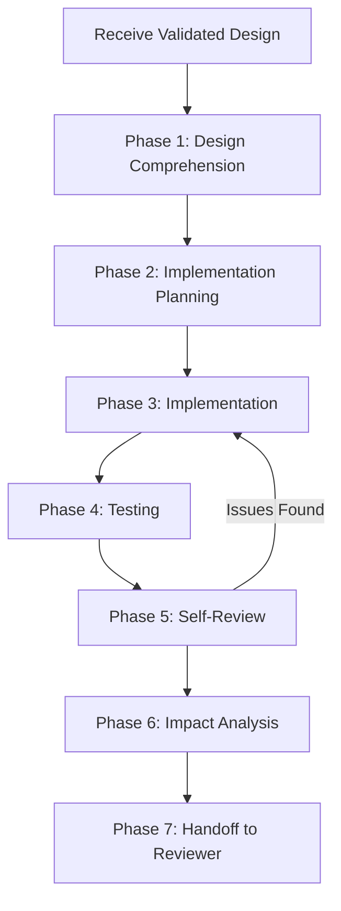

# Implementer Agent — Workflow

## Overview

The Implementer Agent follows a disciplined, phased workflow to produce production-quality code from validated designs.

---

## Workflow Diagram

---

## Phase 1: Design Comprehension

**Goal**: Fully understand what needs to be built.

### Steps
1. Read the complete design document
2. Read all ADRs and understand the decisions
3. Read the Reviewer Agent's feedback and how it was addressed
4. Identify acceptance criteria — how will you know you're done?
5. List any questions or ambiguities — clarify before coding

### Output
- Confirmed understanding of what to build
- List of clarifications needed (if any)

---

## Phase 2: Implementation Planning

**Goal**: Plan the implementation before writing code.

### Steps
1. Break the work into ordered implementation tasks
2. Identify the dependency order — what must be built first?
3. Plan the file structure — what new files, what modifications?
4. Plan the testing strategy — what tests for each component?
5. Identify the minimal change set — fewest changes needed
6. Estimate complexity and flag any concerns

### Output
- Ordered task list
- File change plan
- Testing strategy

---

## Phase 3: Implementation

**Goal**: Write production-quality code.

### Steps

For each task in the plan:

1. **Write the code**
   - Follow code standards (SOLID, DRY, KISS, YAGNI)
   - Handle all error cases
   - Add structured logging
   - Write clean, readable code

2. **Write inline documentation**
   - Docstrings for public APIs
   - Comments for non-obvious "why" logic
   - Type annotations/hints where applicable

3. **Write tests alongside code**
   - Unit tests for business logic
   - Integration tests for external interactions
   - Edge case tests for boundary conditions
   - Error path tests for failure scenarios

### Output
- Production-quality source code
- Comprehensive test suite
- Inline documentation

---

## Phase 4: Testing

**Goal**: Verify the implementation is correct.

### Steps
1. Run all tests — ensure 100% pass rate
2. Review test coverage — are critical paths covered?
3. Manual verification — does it work as expected?
4. Edge case verification — do boundary conditions work?
5. Error case verification — do failures behave correctly?

### Output
- Test results (all passing)
- Coverage report
- Any issues discovered

---

## Phase 5: Self-Review

**Goal**: Review your own code before submitting.

Use the [self-review checklist](self-review-checklist.md) to systematically verify:

1. Design conformance
2. Code quality
3. Error handling
4. Security
5. Performance
6. Testing adequacy
7. Documentation
8. Logging and observability

### Output
- Completed self-review checklist
- Any issues found and fixed

---

## Phase 6: Impact Analysis

**Goal**: Assess the impact of your changes.

### Steps
1. List all files changed with summary of changes
2. Identify potential breaking changes
3. Identify performance implications
4. List deployment requirements (migrations, config changes, etc.)
5. Document any known limitations or follow-up work

### Output
- Impact analysis document
- Deployment notes

---

## Phase 7: Handoff to Reviewer

**Goal**: Package the implementation for code review.

### Steps
1. Compile the change description
2. Include test results
3. Include self-review results
4. Include impact analysis
5. Highlight areas that need careful review
6. Note any deviations from the design (with justification)

### Output
- Complete implementation package ready for Reviewer Agent
