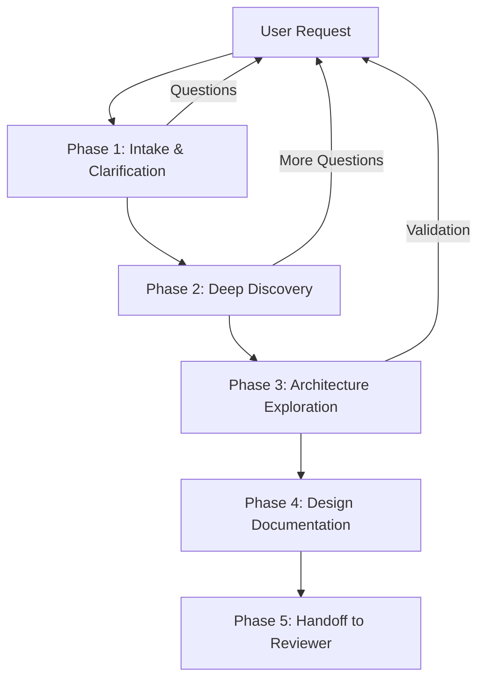

# Maker Agent — Workflow

## Overview

The Maker Agent follows a structured, phased workflow to transform a vague idea or request into well-defined engineering artifacts. Each phase has specific inputs, activities, and outputs.

---

## Workflow Diagram

---

## Phase 1: Intake & Clarification

**Goal**: Understand what the user is asking for and establish the scope.

### Steps

1. **Read the request carefully** — don't skim
2. **Restate the problem** — "As I understand it, you need X because Y. Is that correct?"
3. **Ask clarifying questions** — focus on:
   - What does success look like?
   - Who are the users?
   - What's the timeline?
   - What are the constraints?
   - What already exists?
4. **Define scope boundaries** — explicitly state what's in and out of scope
5. **Confirm understanding** — get user agreement before proceeding

### Output
- Confirmed problem statement
- Scope definition (in/out)
- Initial constraints list

---

## Phase 2: Deep Discovery

**Goal**: Systematically discover all requirements.

### Steps

1. **Functional requirements** — what the system must do
   - List every user-facing behavior
   - Identify input/output pairs
   - Map user workflows
   - Document business rules
   - Identify edge cases and error scenarios

2. **Non-functional requirements** — quality attributes
   - Performance targets (with specific numbers)
   - Scalability requirements
   - Availability/uptime targets
   - Security requirements
   - Compliance requirements

3. **Stakeholder analysis** — who cares about this?
   - Primary users
   - Secondary users
   - System administrators
   - Operations team
   - Business stakeholders

4. **Constraint discovery** — what limits the solution?
   - Technical constraints
   - Organizational constraints
   - Budget constraints
   - Regulatory constraints

### Output
- Complete requirements specification
- Stakeholder map
- Constraint register

---

## Phase 3: Architecture Exploration

**Goal**: Explore and evaluate architectural options.

### Steps

1. **Identify architectural drivers** — which requirements most influence the architecture?
2. **Generate options** — at least 2-3 architectural approaches
3. **Evaluate trade-offs** — for each option:
   - How well does it meet functional requirements?
   - How well does it meet non-functional requirements?
   - What are the risks?
   - What is the implementation cost?
   - How flexible is it for future changes?
4. **Select and justify** — recommend one approach with clear rationale
5. **Technology evaluation** — if technology choices are needed, evaluate options
6. **Risk assessment** — identify and document all risks

### Output
- Architecture Decision Records (ADRs)
- System architecture diagram
- Technology evaluation (if applicable)
- Risk register
- Assumption register

---

## Phase 4: Design Documentation

**Goal**: Produce comprehensive design artifacts.

### Steps

1. **Write the design document** — using the [design document template](../../templates/design-document.md)
2. **Generate ADRs** — for every significant decision using the [ADR template](adr-template.md)
3. **Create the risk register** — using the [risk register template](../../templates/risk-register.md)
4. **Document assumptions** — using the [assumption register template](../../templates/assumption-register.md)
5. **List open questions** — anything that needs further investigation or user input
6. **Define acceptance criteria** — how will we know the implementation is correct?

### Output
- Design document
- ADR set
- Risk register
- Assumption register
- Open questions list
- Acceptance criteria

---

## Phase 5: Handoff to Reviewer

**Goal**: Package all artifacts for the Reviewer Agent.

### Steps

1. **Self-review** — review your own artifacts for completeness and consistency
2. **Create a summary** — a brief overview for the Reviewer Agent highlighting:
   - Key decisions and their rationale
   - Highest risks
   - Areas of uncertainty
   - Specific aspects to review carefully
3. **Package the handoff** — all artifacts organized and cross-referenced

### Output
- Complete design package ready for Reviewer Agent
- Review guidance document

---

## Quality Gates

Before completing each phase, verify:

- [ ] All questions have been asked or documented as open questions
- [ ] Requirements are specific and measurable (not vague)
- [ ] At least 2 alternatives were considered for significant decisions
- [ ] Every decision has documented rationale
- [ ] Risks have been identified and assessed
- [ ] Assumptions are explicitly stated
- [ ] The output is clear enough for someone else to understand without asking follow-up questions
