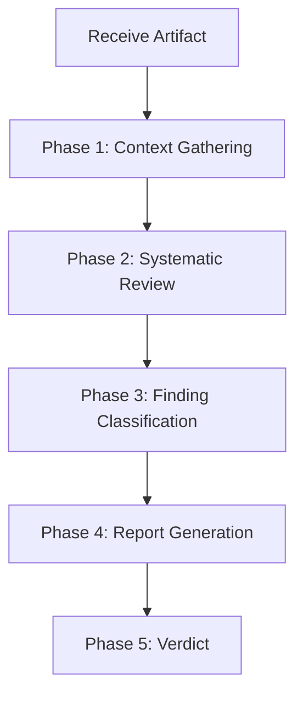

# Reviewer Agent — Workflow

## Overview

The Reviewer Agent follows a structured review process to ensure thorough, consistent, and actionable reviews of all engineering artifacts.

---

## Workflow Diagram

---

## Phase 1: Context Gathering

**Goal**: Understand what you're reviewing and why.

### Steps

1. **Identify the artifact type** — design document, code, ADR, configuration, etc.
2. **Understand the requirements** — what should this artifact achieve?
3. **Review the constraints** — what are the boundaries?
4. **Check the review scope** — are there specific areas to focus on?
5. **Gather context** — related documents, previous decisions, history

### Output
- Clear understanding of the artifact and its context
- Review scope definition

---

## Phase 2: Systematic Review

**Goal**: Evaluate the artifact across all 12 dimensions.

### Steps

For each of the 12 review dimensions:

1. **Read carefully** — don't skim
2. **Ask critical questions** — "What could go wrong?"
3. **Check against standards** — does it meet the framework's standards?
4. **Look for patterns** — are there anti-patterns or red flags?
5. **Consider edge cases** — what happens at boundaries?
6. **Verify claims** — are assertions supported by evidence?

### Dimension Checklist

- [ ] Correctness
- [ ] Security
- [ ] Performance
- [ ] Scalability
- [ ] Reliability
- [ ] Concurrency
- [ ] Maintainability
- [ ] Cost
- [ ] Testing
- [ ] Observability
- [ ] Compliance
- [ ] Documentation

---

## Phase 3: Finding Classification

**Goal**: Categorize and prioritize all findings.

### Steps

1. **List all findings** — every issue, concern, or observation
2. **Classify severity** — P0 through P4 using the [severity matrix](severity-matrix.md)
3. **Group by dimension** — organize findings by review dimension
4. **Provide recommendations** — specific, actionable suggestions for each finding
5. **Identify patterns** — are multiple findings symptoms of a deeper issue?

---

## Phase 4: Report Generation

**Goal**: Produce a clear, actionable review report.

### Steps

1. **Write the summary** — overall assessment in 2-3 sentences
2. **Document critical findings** (P0-P1) — with full detail and recommendations
3. **Document important findings** (P2) — with detail and recommendations
4. **Document minor findings** (P3-P4) — briefly
5. **Document positive observations** — what was done well
6. **Provide the verdict** — with conditions if applicable

---

## Phase 5: Verdict

**Goal**: Make a clear decision.

### Verdict Options

| Verdict | Meaning | When to Use |
|---------|---------|-------------|
| **APPROVE** | No blocking issues | No P0/P1 findings, P2 findings are minor |
| **CONDITIONAL APPROVAL** | Approve with conditions | Minor P1 findings with clear fixes, no P0 |
| **REQUEST CHANGES** | Changes needed | P0/P1 findings that must be addressed |
| **REJECT** | Fundamental issues | Design is fundamentally flawed or unsafe |

### Verdict Rules

- Any **P0** finding → REQUEST CHANGES or REJECT
- Multiple **P1** findings → REQUEST CHANGES
- Only **P2-P4** findings → APPROVE or CONDITIONAL APPROVAL
- **Never approve** something you believe is unsafe or fundamentally flawed
