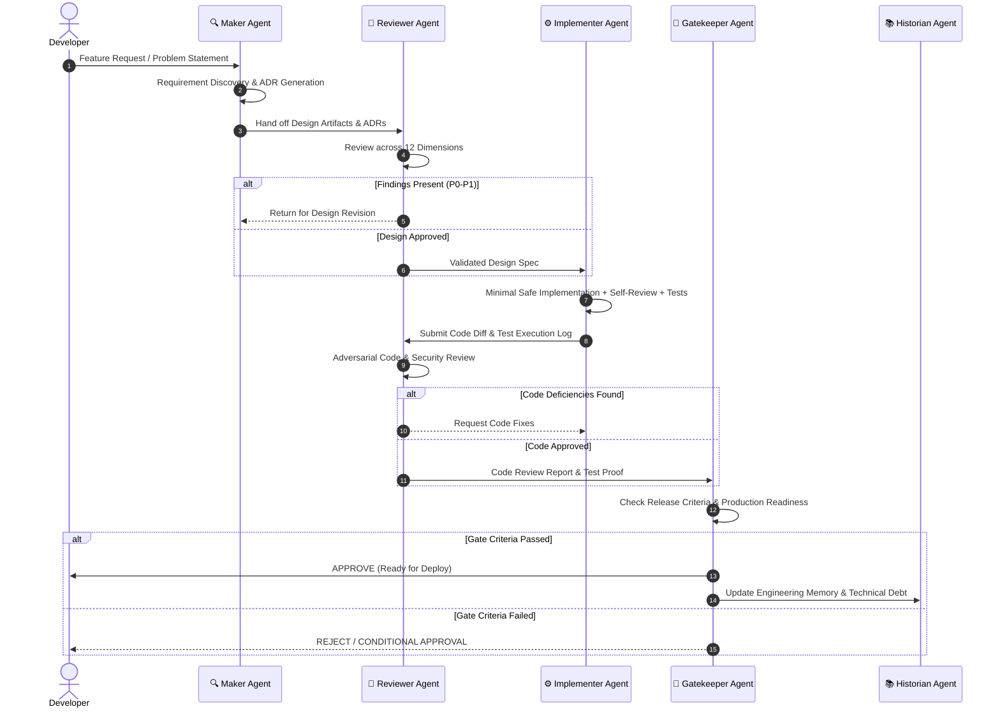

# 🔄 Agent Orchestration Guide

This document explains how the 5 specialized AEF agents interact and hand off state throughout the development process.

---

## The Hand-Off Pipeline

---

## Inter-Agent Contracts

### Contract 1: Maker → Reviewer
- **Artifacts Handed Off**:
  - Requirements Specification (Functional + NFR)
  - Architecture Decision Records (ADRs)
  - Assumption & Risk Register
- **Gate Criteria**:
  - All non-functional metrics must have explicit targets (e.g. latency < 200ms p95).
  - Alternatives considered must be documented.

### Contract 2: Reviewer → Implementer
- **Artifacts Handed Off**:
  - Approved Design Specification
  - List of design trade-offs to preserve
  - Specific edge cases highlighted for testing

### Contract 3: Implementer → Reviewer
- **Artifacts Handed Off**:
  - Git Diff / Code Changes
  - Unit & Integration Test Results
  - Completed Self-Review Checklist

### Contract 4: Reviewer → Gatekeeper
- **Artifacts Handed Off**:
  - Code Review Report (P0–P4 severity log)
  - Verdict (APPROVE / CONDITIONAL / REJECT)

### Contract 5: Gatekeeper → Historian
- **Artifacts Handed Off**:
  - Final Release Summary
  - Registered Technical Debt (if any)
  - Traceability Matrix Update
