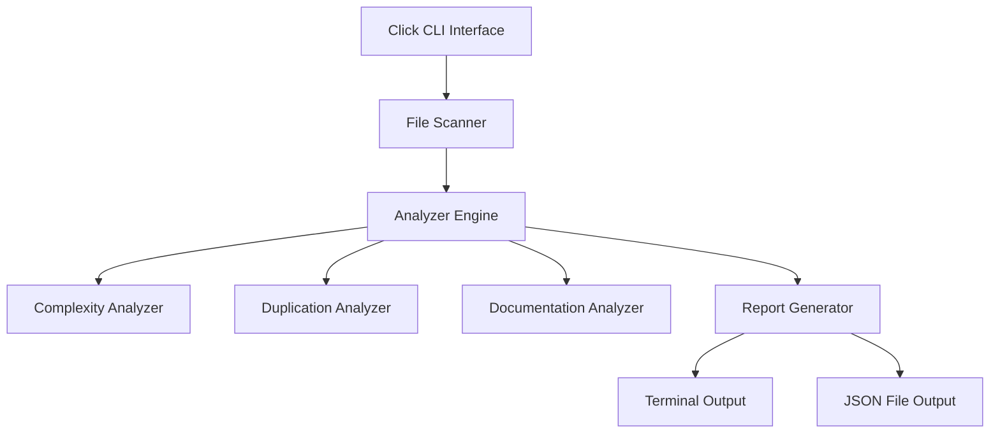

# CLI Tool Project — Architecture Phase

## ADR-001: CLI Framework
**Decision**: Click (Python) — mature, well-documented, clean API for building CLI tools.

## ADR-002: Analysis Architecture
**Decision**: Plugin-based analyzer architecture — each analysis type (complexity, duplication, docs) is an independent plugin, making it easy to add new analyzers.

## Architecture

