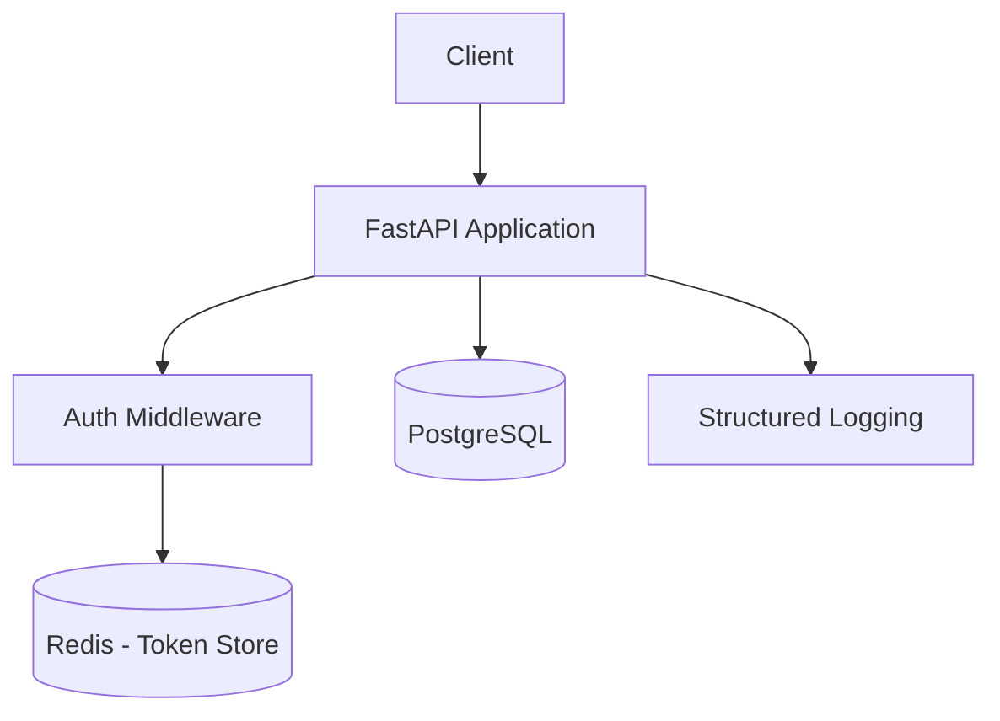

# Web API Project — Architecture Phase

## ADR-001: API Framework Selection

**Status**: Accepted | **Date**: 2026-08-07

**Context**: Need a Python REST API framework.

**Options**: FastAPI vs Django REST Framework vs Flask

**Decision**: FastAPI — best DX, auto OpenAPI docs, async support, type safety.

## ADR-002: Database Selection

**Status**: Accepted

**Decision**: PostgreSQL — reliable, well-supported, strong data integrity.

## ADR-003: Authentication Strategy

**Status**: Accepted

**Decision**: JWT with short-lived access tokens (15 min) + refresh tokens (7 days) + Redis-backed blacklist for revocation.

## System Architecture

