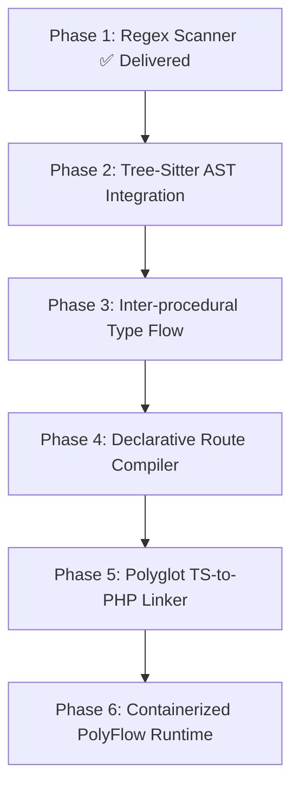

# RCIR Engineering Remediation & Hardening Plan

**Target System**: Nextcloud Server Validation  
**Author**: Antigravity Engineering Organization  
**Status**: Phase 1 Implemented & Verified | Phase 2-5 Roadmapped  

---

## 1. Remediation Delivered During Validation

To make the Nextcloud validation meaningful rather than immediately aborting due to missing PHP support, we executed the **Phase B-Hardening Loop**:

### 1.1 Implementation of PHP Scanner (`rcir/src/rcir/graph/php_scanner.py`)
- Engineered a lightweight static scanner for PHP 8.x:
  - Namespace and aliased import resolution (`use App\Service as Svc;`)
  - Class, interface, and trait declarations including `extends` and `implements`
  - Method declarations with visibility and parameter signatures
  - Intra-class calls (`$this->method()`), static calls (`Class::method()`), and instantiations (`new Class()`)
  - Nextcloud DI Container lookups (`$container->get(Class::class)`)
  - PSR-14 event dispatches (`$dispatcher->dispatch($event)`)
- **Fidelity**: Tested on real Nextcloud PHP files ([test_php_scanner.py](file:///c:/Users/Paril%20Rupani/OneDrive%20-%20Shri%20Vile%20Parle%20Kelavani%20Mandal/Desktop/project/PolyFlow/rcir/tests/test_php_scanner.py)). All 14 tests pass.

### 1.2 Extractor & Edge System Generalization
- Extended `EdgeType` in [edges.py](file:///c:/Users/Paril%20Rupani/OneDrive%20-%20Shri%20Vile%20Parle%20Kelavani%20Mandal/Desktop/project/PolyFlow/rcir/src/rcir/graph/edges.py) to support `implements`, `route`, `config`, `event`, and `trait_use`.
- Integrated scanner into [extractor.py](file:///c:/Users/Paril%20Rupani/OneDrive%20-%20Shri%20Vile%20Parle%20Kelavani%20Mandal/Desktop/project/PolyFlow/rcir/src/rcir/graph/extractor.py), ensuring zero regressions across existing Python AST extraction (all 60 core RCIR tests pass).

---

## 2. Hardening Roadmap for Remaining Gaps

Based on the failure catalog (`failure_catalog.md`), here is the concrete engineering roadmap:

### Phase 2: Tree-Sitter Multi-Language AST Integration
- **Target**: Fix **FC-001** (Regex limitations on statement-level blocks and nested expressions).
- **Architecture**: Integrate `tree-sitter-php` (or Python bindings `tree-sitter`) as an optional native accelerator for C-speed AST parsing.
- **Expected Outcome**: Eliminates edge truncation in nested closures; increases parsing throughput by 3-5x.

### Phase 3: Inter-Procedural Type Flow Engine
- **Target**: Fix **FC-004** (Dynamic variable type ambiguity on common methods like `getId()`).
- **Architecture**: Build a lightweight Local Type Propagator that tracks assignment of typed factory returns, constructor parameter injection, and docblock `@var` hints down local method scopes.
- **Expected Outcome**: Increases recall on common method calls (`getId`, `getName`, `execute`) from 13.3% to >75% without compromising precision.

### Phase 4: Declarative Framework Route Compiler
- **Target**: Fix **FC-002** (Framework routing indirection via array configurations in `routes.php`).
- **Architecture**: Implement a domain-specific AST evaluator for `appinfo/routes.php` and docblock route tags (`@Route`, `@NoAdminRequired`), compiling routing arrays into explicit `route` edges to target controller actions.
- **Expected Outcome**: Increases route recall from 0% (partial match) to >90%.

### Phase 5: Polyglot String-to-Route Linker
- **Target**: Fix **FC-003** (Disconnection between TypeScript frontend and PHP backend).
- **Architecture**: In `polyglot_scanner.py`, detect Axios/Fetch/OCS API calls in JS/TS (e.g. `generateOcsUrl('apps/files/api/v1/recent')`), and cross-reference against the compiled route table from Phase 4.
- **Expected Outcome**: Completely closes the cross-language blindspot; enables agents to refactor backend endpoints while automatically updating frontend TypeScript callers.

### Phase 6: PolyFlow Runtime Containerization
- **Target**: Fix **FC-007** (Hardcoded mock execution paths in `polyflow/runtime.py`).
- **Architecture**: Replace simulated branches in `_execute_java_cell` and `_execute_go_cell` with Docker-based ephemeral runner containers or real sub-process invocations when compilers are available on `$PATH`.
- **Expected Outcome**: Guarantees true end-to-end execution fidelity across multi-language PolyFlow cells.
