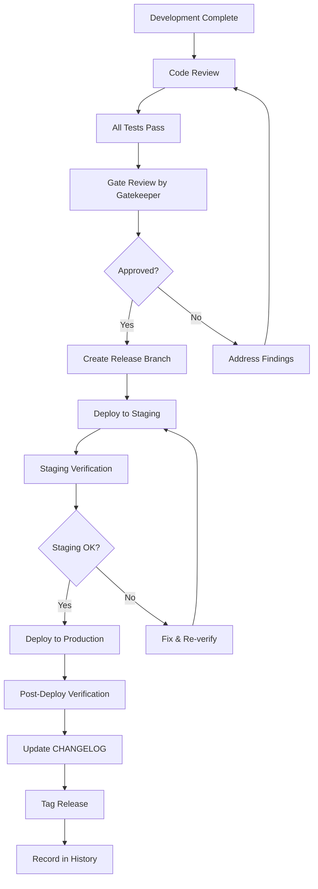

# Release Process

## Purpose
Define the process for releasing software to production.

## Release Workflow

## Release Checklist

- [ ] All tests pass on CI/CD
- [ ] Gatekeeper Agent approved
- [ ] CHANGELOG updated
- [ ] Version bumped
- [ ] Release notes written
- [ ] Staging deployment successful
- [ ] Staging verification complete
- [ ] Rollback plan documented
- [ ] Monitoring dashboards ready
- [ ] On-call team notified

## Rollback Procedure

1. Identify the issue
2. Decide: fix forward or roll back
3. If rolling back: deploy the previous version
4. Verify rollback succeeded
5. Document the incident
6. Investigate root cause
