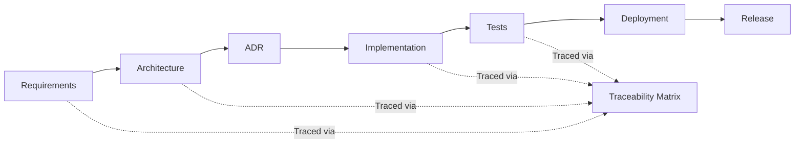

# Traceability Model

## Full Lifecycle Traceability

## Traceability Rules

1. **Every requirement** must have a corresponding implementation
2. **Every implementation** must trace back to a requirement
3. **Every significant decision** must have an ADR
4. **Every implementation** must have corresponding tests
5. **Every release** must have a traceability matrix showing all items

## Traceability Matrix
Use the [Traceability Matrix Template](../templates/traceability-matrix.md) to track requirements through the lifecycle.

## Forward Traceability
From requirements forward: Which code implements this requirement? Which tests verify it?

## Backward Traceability
From code backward: Why does this code exist? What requirement drove it? What decision justified this approach?
